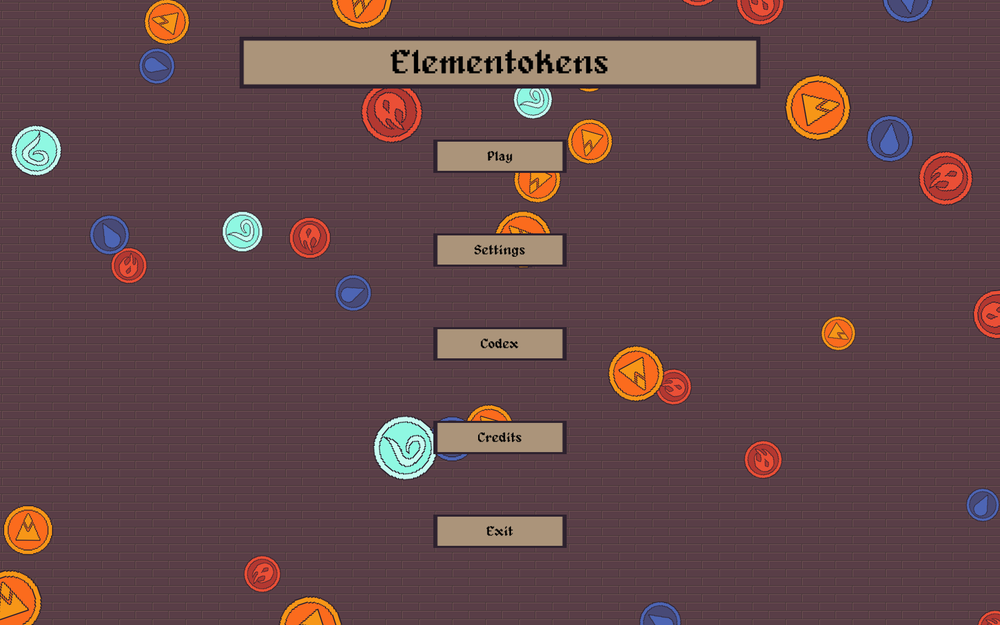
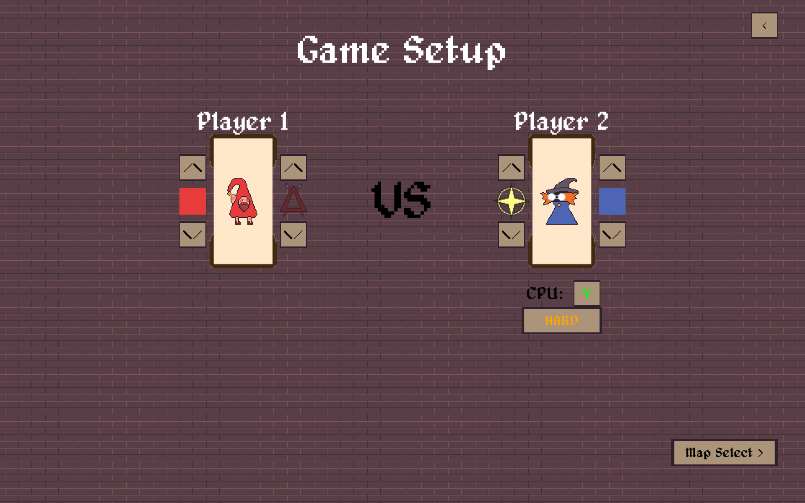
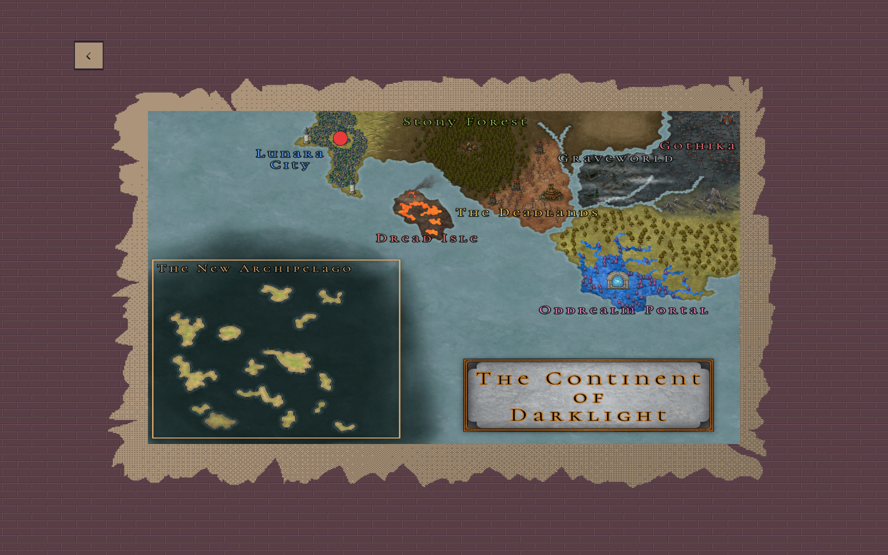
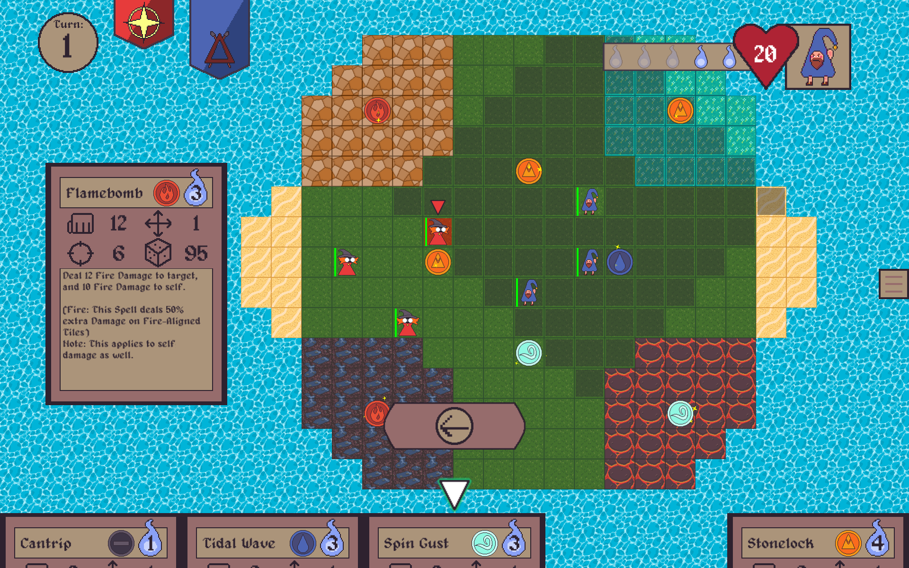
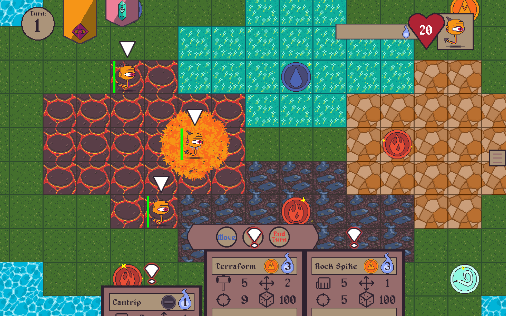
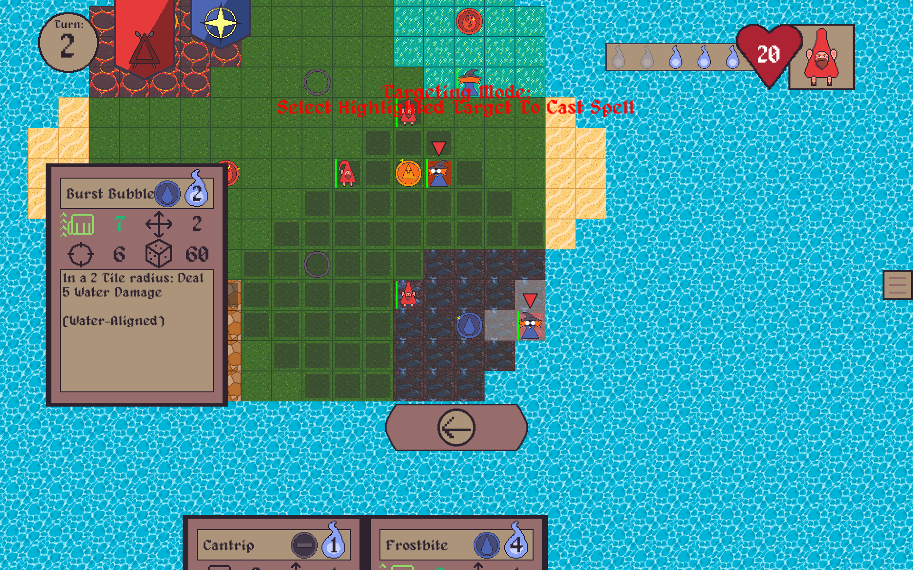
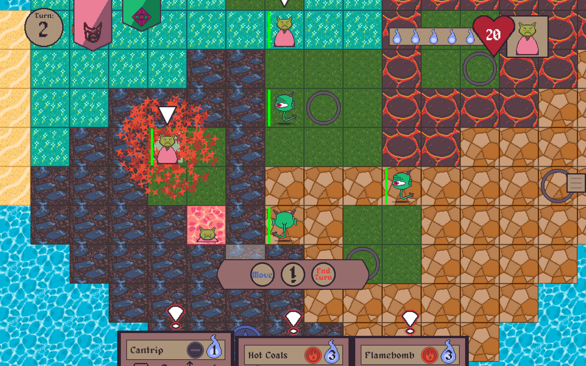

# Description

Harness the power of the mysterious Elementokens and command an army of spell-slinging wizards! 
Elementokens is a tactical, turn-based strategy game for 1–2 players featuring over 20 unique spells, 15 battle maps, 
and 10 distinct playable factions. Whether you’re diving into the story-driven campaign or engaging in fast-paced skirmishes, 
Elementokens offers a deep, replayable experience full of strategic depth and magical warfare.

# Screenshots

